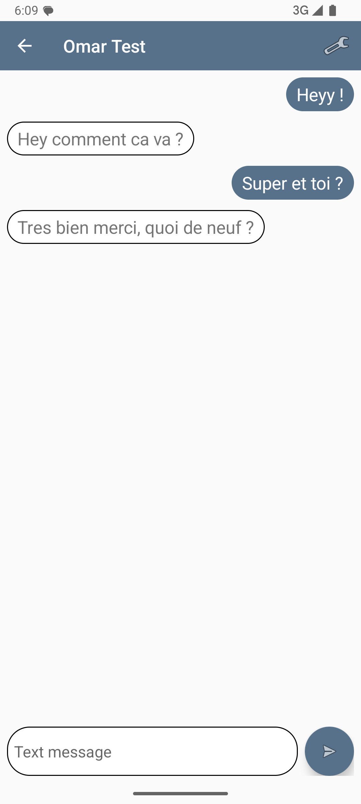

# Ft_hangouts
Ft_hangouts is a mobile application developed as part of a 42 school project.
It serves as a hands-on introduction to native Android development using Java, Android Studio, and the Android SDK. 
The app offers essential contact and messaging features, with a customizable and multilingual user interface.

## Home Screen

Displays a summary view of all contacts, including their status or latest activity.

 

## Contact Management

Add, edit, or delete contacts with a smooth and intuitive interface.

   

## Messaging

Send and receive messages with a clean conversation history layout.

 

## UI Customization & Multilingual Support

Change the appearance of the app by customizing the header color and language.

 
